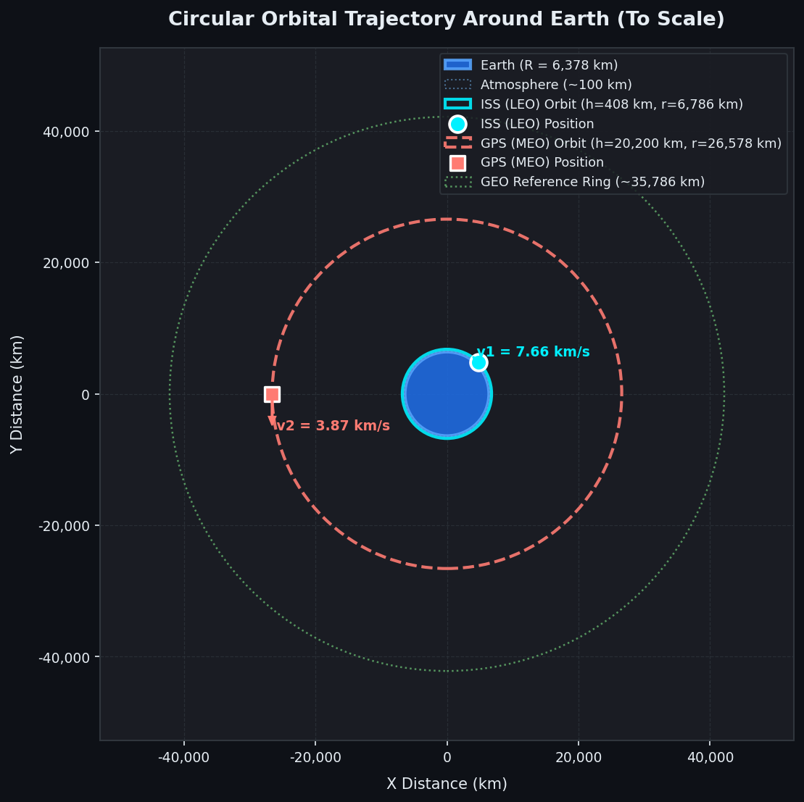

# 🛰️ Satellite Orbit Analysis & Visualization System

An interactive Python simulation and visualization platform for calculating, analyzing, and visualizing Keplerian circular satellite orbital parameters around Earth using classical orbital mechanics.

---

## 📋 Table of Contents
1. [Project Overview](#-project-overview)
2. [Key Objectives](#-key-objectives)
3. [Technologies Used](#-technologies-used)
4. [Project Structure](#-project-structure)
5. [Basic Orbital Mechanics Concepts](#-basic-orbital-mechanics-concepts)
6. [Formulas and Derivations](#-formulas-and-derivations)
7. [Physical Constants Used](#-physical-constants-used)
8. [Installation and Setup](#-installation-and-setup)
9. [Running the Application](#-running-the-application)
10. [Example Inputs & Calculated Outputs](#-example-inputs--calculated-outputs)
11. [Running the Automated Tests](#-running-the-automated-tests)
12. [Project Limitations & Real-World Perturbations](#-project-limitations--real-world-perturbations)

---

## 🔭 Project Overview

In space mission design, understanding how altitude dictates a satellite's speed, period, and gravitational environment is the first step in selecting the right orbit for a spacecraft (e.g., Earth observation in LEO vs. continuous regional communication in GEO).

This project provides an interactive dashboard where a user can enter satellite orbital parameters (altitude, mass, comparison orbits) and immediately observe:
- Scaled 2D trajectory visualizations around Earth.
- Velocity vectors and positions along the orbit.
- Sensitivity trade-off curves (Altitude vs. Velocity, Period, Gravity).
- Side-by-side orbit comparisons.
- Grounded comparisons with real spacecraft (ISS, Hubble, Starlink, GPS, GEO comsats).

<p align="center">
  
</p>

---

## 🎯 Key Objectives

1. **Calculate Core Orbital Parameters**: Orbital radius, circular speed, orbital period, gravitational acceleration, and daily revolutions.
2. **Interactive Visualizations**: Render 2D scaled circular orbits with Earth, atmosphere boundary, satellite markers, and velocity vectors.
3. **Compare Mission Regimes**: Compare Low Earth Orbit (LEO), Medium Earth Orbit (MEO), and Geostationary Orbit (GEO).
4. **Clean Code & Test Coverage**: Modular architecture with comprehensive docstrings and unit tests.
5. **Automated Verification**: Complete unit test suite ensuring calculation consistency and mathematical adherence to Kepler's Third Law.

---

## 💻 Technologies Used

| Technology | Purpose |
|------------|---------|
| **Python 3.10+** | Core programming language |
| **NumPy** | Array generation for altitude parameter sweeps |
| **Matplotlib** | 2D orbital trajectory diagrams and sensitivity curves |
| **Streamlit** | Interactive aerospace web dashboard |
| **Pandas** | Tabular display and filtering of real-world satellite reference data |
| **unittest / pytest** | Automated test verification of astrodynamics formulas |

---

## 📂 Project Structure

```text
satellite_orbit_analysis/
│
├── app.py                      # Main Streamlit web dashboard
├── requirements.txt            # Python dependencies
├── README.md                   # Comprehensive project documentation
│
├── src/
│   ├── __init__.py             # Package exports
│   ├── orbital_calculations.py # Core physics functions and constants
│   └── visualization.py        # Matplotlib plotting routines
│
├── data/
│   └── sample_orbit_data.csv   # Curated database of real satellite missions
│
└── tests/
    └── test_orbital_calculations.py # Unit tests verifying known values
```

---

## 🌌 Basic Orbital Mechanics Concepts

### 1. Two-Body Problem
We model Earth and the satellite as two spherical point masses moving under mutual gravitational attraction according to Newton's Law of Universal Gravitation. Because Earth's mass ($M_E \approx 5.97 \times 10^{24}\text{ kg}$) is vast compared to a satellite ($m \sim 10^2 - 10^5\text{ kg}$), Earth is assumed fixed at the center of the coordinate system.

### 2. Circular Orbit ($e = 0$)
A circular orbit is an orbit where the eccentricity $e = 0$ and the distance from Earth's center remains constant:
$$r = R_E + h$$

### 3. Orbit Regimes
- **LEO (Low Earth Orbit, 160 – 2,000 km)**: Short orbital periods (~90 to 120 minutes), high velocity (~7.5 to 7.8 km/s). Ideal for Earth imaging, weather monitoring, and human spaceflight (ISS).
- **MEO (Medium Earth Orbit, 2,000 – 35,786 km)**: Moderate velocity and 12-hour periods. Ideal for global navigation satellite constellations (GPS, Galileo, GLONASS).
- **GEO (Geostationary Orbit, ~35,786 km)**: Orbital period exactly equals Earth's rotational period (1 sidereal day = 23h 56m 4s). The satellite remains fixed over one spot on the equator. Ideal for telecommunications and weather satellites.
- **HEO (High Earth Orbit, > 35,786 km)**: Deep space science and high-ellipticity missions.

---

## 📐 Formulas and Derivations

### 1. Orbital Radius ($r$)
$$r = R_E + h$$
- $R_E$: Radius of Earth ($6,378.137\text{ km}$)
- $h$: Altitude above Earth's surface in km

### 2. Circular Orbital Velocity ($v$)
A satellite maintains circular motion when the inward gravitational pull provides the exact centripetal force required:
$$F_{\text{gravity}} = F_{\text{centripetal}}$$
$$\frac{G M_E m}{r^2} = \frac{m v^2}{r}$$

Dividing both sides by satellite mass $m$ and multiplying by $r$:
$$v^2 = \frac{G M_E}{r} = \frac{\mu}{r} \implies v = \sqrt{\frac{\mu}{r}}$$

*Takeaway:* Satellite mass $m$ cancels out. A 400-ton space station and a 1-kg CubeSat travel at the exact same speed at the same altitude.

### 3. Orbital Period ($T$)
The distance traveled during one complete circular orbit is circumference $2\pi r$. With constant speed $v$:
$$T = \frac{2\pi r}{v} = \frac{2\pi r}{\sqrt{\mu / r}} = 2\pi \sqrt{\frac{r^3}{\mu}}$$

Squaring both sides shows **Kepler's Third Law**:
$$T^2 = \left(\frac{4\pi^2}{\mu}\right) r^3 \implies T^2 \propto r^3$$

### 4. Gravitational Acceleration at Altitude ($g(h)$)
$$g(h) = \frac{\mu}{r^2} = \frac{\mu}{(R_E + h)^2}$$
Expressed in $\text{m/s}^2$:
$$g(h) = \left(\frac{\mu_{\text{km}^3/\text{s}^2}}{r_{\text{km}}^2}\right) \times 1000$$

### 5. Orbits Per Day ($N$)
$$N = \frac{86,400\text{ seconds}}{T\text{ (seconds)}}$$

---

## 🌍 Physical Constants Used

| Constant | Symbol | Value | Unit | Description |
|----------|--------|-------|------|-------------|
| Earth Equatorial Radius | $R_E$ | $6,378.137$ | $\text{km}$ | WGS-84 reference standard |
| Earth Gravitational Parameter | $\mu = GM_E$ | $398,600.4418$ | $\text{km}^3/\text{s}^2$ | Standard geocentric gravitational constant |
| Earth Mass | $M_E$ | $5.9722 \times 10^{24}$ | $\text{kg}$ | Total Earth mass |
| Universal Gravitational Constant | $G$ | $6.6743 \times 10^{-11}$ | $\text{m}^3/(\text{kg}\cdot\text{s}^2)$ | Newtonian constant |
| Sea Level Gravity | $g_0$ | $9.80665$ | $\text{m/s}^2$ | Standard acceleration at sea level |
| GEO Altitude | $h_{\text{GEO}}$ | $35,786.0$ | $\text{km}$ | Altitude where $T = 23\text{h } 56\text{m } 4\text{s}$ |

> **Note on $\mu$:** In astrodynamics, $\mu = G \times M$ is measured directly from satellite tracking with high precision ($\sim 10^{-9}$), avoiding laboratory uncertainties in $G$.

---

## 🛠️ Installation and Setup

### 1. Clone or Navigate to the Project Directory
```bash
cd satellite_orbit_analysis
```

### 2. Set Up a Virtual Environment (Recommended)
```bash
python -m venv venv

# On Windows (PowerShell):
venv\Scripts\Activate.ps1

# On macOS/Linux:
source venv/bin/activate
```

### 3. Install Dependencies
```bash
pip install -r requirements.txt
```

---

## 🚀 Running the Application

Launch the Streamlit web dashboard:
```bash
streamlit run app.py
```
Then open your browser at `http://localhost:8501`.

---

## 📊 Example Inputs & Calculated Outputs

### Example 1: International Space Station (LEO)
- **Input Altitude ($h$):** $408.0\text{ km}$
- **Orbital Radius ($r$):** $6,786.137\text{ km}$
- **Orbital Velocity ($v$):** $7.664\text{ km/s}$ (~$27,590\text{ km/h}$)
- **Orbital Period ($T$):** $92.68\text{ minutes}$ (~$1.54\text{ hours}$)
- **Local Gravity ($g$):** $8.66\text{ m/s}^2$ ($88.3\%$ of sea level gravity)
- **Orbits per Day:** $15.54\text{ revolutions/day}$

### Example 2: Geostationary Satellite (GEO)
- **Input Altitude ($h$):** $35,786.0\text{ km}$
- **Orbital Radius ($r$):** $42,164.137\text{ km}$
- **Orbital Velocity ($v$):** $3.075\text{ km/s}$ (~$11,070\text{ km/h}$)
- **Orbital Period ($T$):** $1,436.07\text{ minutes}$ ($23.93\text{ hours}$ = $1\text{ sidereal day}$)
- **Local Gravity ($g$):** $0.224\text{ m/s}^2$ ($2.3\%$ of sea level gravity)
- **Orbits per Day:** $1.00\text{ revolution/day}$

---

## 🧪 Running the Automated Tests

To run the full unit test suite:
```bash
python -m unittest tests/test_orbital_calculations.py
```
Or using pytest:
```bash
pytest tests/
```

The test suite checks:
1. Exact radius calculations ($r = R + h$).
2. ISS benchmark velocity (~7.66 km/s) and period (~92.7 min).
3. GEO benchmark period (~23.93 hours) and velocity (~3.075 km/s).
4. Local gravity in LEO (~8.66 m/s²).
5. Constancy of Kepler's 3rd Law ratio ($T^2 / r^3 = \text{const}$).
6. Input validation (rejecting negative altitudes, non-numeric values, NaN).
7. Energy conservation and Virial Theorem ($E_k = -0.5 E_p$).

---

## ⚠️ Project Limitations & Real-World Perturbations

This project is intentionally structured as a clear, introductory two-body circular model. In real space mission design, several orbital perturbations must be modeled:

1. **Earth Oblateness ($J_2$ Perturbation)**: Earth is an oblate spheroid (fatter at the equator). This non-spherical gravity causes nodal regression and apsidal precession.
2. **Atmospheric Drag**: In LEO (< 600 km), residual atmosphere robs satellites of mechanical energy, causing orbital decay.
3. **Third-Body Gravitation**: In higher orbits (MEO, GEO), the gravitational pull of the Moon and Sun perturbs the orbit over months and years.
4. **Solar Radiation Pressure (SRP)**: Photons from sunlight transfer momentum to large solar arrays, subtly modifying orbital eccentricity.
5. **Eccentricity ($e > 0$)**: Real orbits are slightly elliptical (Kepler's First Law), where speed varies between perigee (closest, fastest) and apogee (farthest, slowest).
